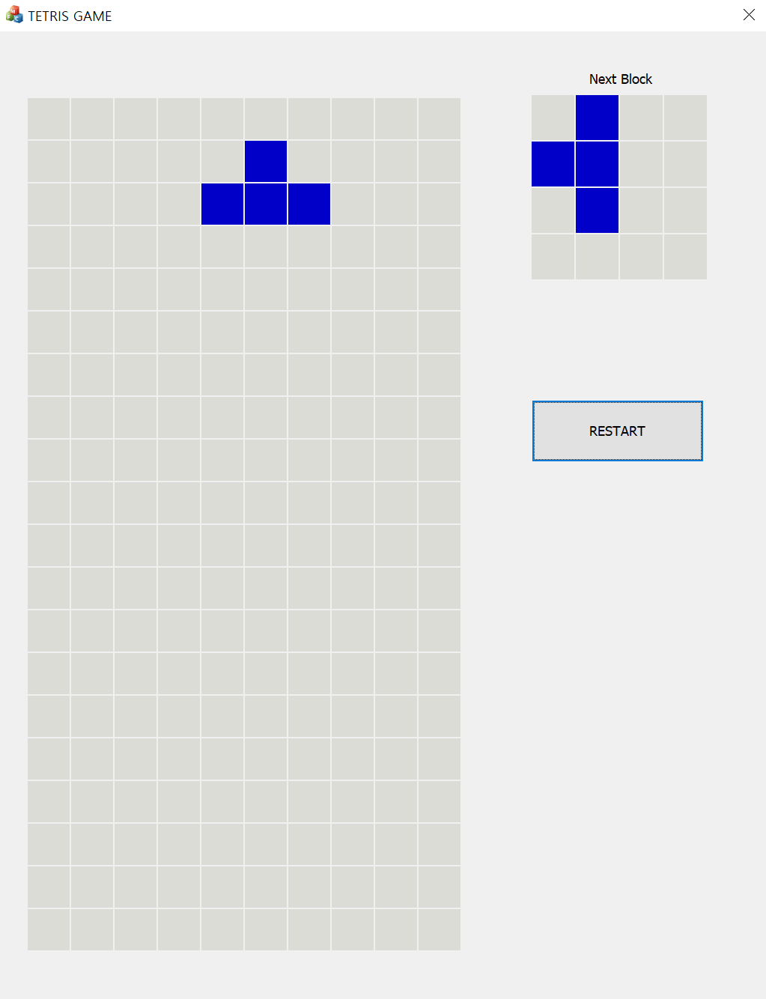

# Tetris

## MFC를 이용한 테트리스 게임

## 1. 개발 환경

- OS : Windows 10
- IDE : Visual Studio 2019
- Language : C++

## 2. 조작법

- 방향키 ← → : 좌우 이동
- 방향키 ↑ : 회전
- 방향키 ↓ : 빠른 낙하

## 3. 게임 화면

## 개발 멤버

- [김남주](http://www.github.com/cmsong111) - [게임 로직 담당](https://github.com/cmsong111/simple-tetris-for-mfc)
- [이지민](http://www.github.com/LEEJiMin003) - UI 담당
- [박세준](http://www.github.com/MynameisSejun) - UI 담당
